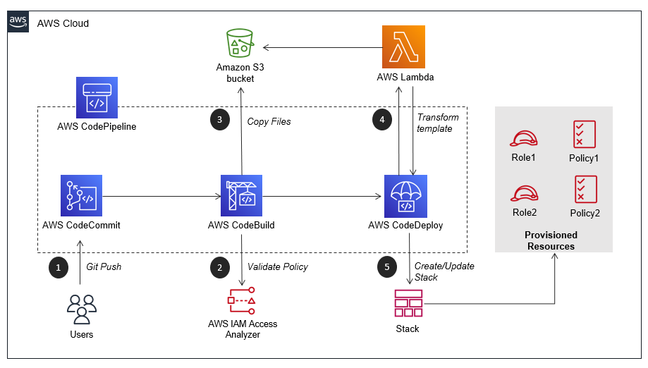

# Deployment pipeline for validating and deploying IAM Roles and Policies on AWS Accounts

This project implements a solution to automate the process of validating and deploying IAM Roles in AWS Accounts with appropriate protection in place.

This repository contains the implementation of the pattern described in [Validate and deploy IAM Roles in AWS Accounts using CodePipeline, Access Analyser and CloudFormation Macros](https://docs.aws.amazon.com/prescriptive-guidance/latest/patterns/automatically-validate-and-deploy-iam-policies-and-roles-in-an-aws-account-by-using-codepipeline-iam-access-analyzer-and-aws-cloudformation-macros.html).

## Problem
Development teams need to create IAM Roles in AWS Accounts where their applications will run. Security team needs to make sure that the IAM Roles don't introduce any threat for the company. So, in order to avoid the creation of unsafe IAM roles, companies usually centralize the creation of IAM roles in a single team that evaluates the dev team request before allowing them to deploy their roles. This manual evaluation can break the deployment flow, since dev teams need to wait for the security team aprove or reprove their request.

## Solution
The solution presented here implements a deployment pipeline (RolesPipeline) that leverages IAM Access Analyzer to validate grammar and best practices of IAM policies that will be attached to the roles and CloudFormation (CF) to deploy the roles.
CloudFormation template, applied during the deployment stage, makes use of a Macro that transforms the repo's files into valid IAM resources and also includes a PermissionsBoundary to the roles. <br/>
With this solution in place, dev team has autonomy to create roles without waiting for external approvals and security team can trust on IAM Access Analyzer and PermissionsBoundary to limit the permissions of the roles created by the dev team.



> `lambda.roles_macro.py` contains the CloudFormation Macro implementation (step 4) to tranform json files into CloudFormation `AWS::IAM::Role` resources.

> For more information about how the solution works, see [the pattern related to this repository](https://apg-library.amazonaws.com/content-viewer/author/df1add4d-f211-43e3-8976-5314da75f627).


### RolesPipeline's repository structure

The `roles-example` folder contains a sample of how the repository connected to the RolesPipeline should be structured.

**File structure**

The root directory of the pipeline repository must have a file called `roles.json`. This file is a map, whose keys are the role's name and the value is an object with the role definition:

```js
{
    "first-role-name": {
        "Service": [
           "ec2.amazonaws.com"
        ],
        "Path": "/",
        "Policies": [policy-file1, policy-file2],
        "Description": "",
        "MaxDuration": 900
    },
    "second-role-name": {
        ...
    },
    // can contains severals roles
}
```
    
> *Service* and *Policies* are mandatory attributes for each role definition. <br/>
> Attribute *Policies* must contain an array of json file paths (where it is the policies that must be attached to roles).

Example:

```
+— roles.json
+— policy-ec2/
+—         policy1.json
+—         policy2.json
+— policy-lambda/
+—         policy1.json
+—         policy2.json
```

**roles.json**:

```json
{
    "role1-ec2": {
        "Service": ["ec2.amazonaws.com"],
        "Path": "/",
        "Policies": [
            "policy-ec2/policy1.json", "policy-ec2/policy2.json"
        ]
    },
    "role2-lambda": {
        "Service": ["lambda.amazonaws.com"],
        "Path": "/",
        "Policies": [
            "policy-lambda/policy1.json", "policy-lambda/policy2.json"
        ]
    }
}
```

Previous files will be tranformed in the following CF Template:

```json
{
    "AWSTemplateFormatVersion": "2010-09-09",
    "Resources": {
        "role1Dashec2Resource": {
            "Type": "AWS::IAM::Role",
            "Properties": {
                "AssumeRolePolicyDocument": {
                    "Version": "2012-10-17",
                    "Statement": [
                        {
                            "Effect": "Allow",
                            "Principal": {
                                "Service": [
                                    "ec2.amazonaws.com"
                                ]
                            },
                            "Action": [
                                "sts:AssumeRole"
                            ]
                        }
                    ]
                },
                "Path": "/",
                "Policies": [
                    {
                        "PolicyName": "policy1",
                        "PolicyDocument": {
                            "Version": "2012-10-17",
                            "Statement": [
                                {
                                    "Effect": "Allow",
                                    "Action": [
                                        "cloudformation:Describe*",
                                        "cloudformation:List*",
                                        "cloudformation:Get*"
                                    ],
                                    "Resource": "*"
                                }
                            ]
                        }
                    },
                    {
                        "PolicyName": "policy2",
                        "PolicyDocument": {
                            "Version": "2012-10-17",
                            "Statement": [
                                {
                                    "Effect": "Allow",
                                    "Action": [
                                        "cloudformation:Describe*",
                                        "cloudformation:List*",
                                        "cloudformation:Get*"
                                    ],
                                    "Resource": "*"
                                }
                            ]
                        }
                    }
                ]
            }
        },
        "role2DashlambdaResource": {
            "Type": "AWS::IAM::Role",
            "Properties": {
                "AssumeRolePolicyDocument": {
                    "Version": "2012-10-17",
                    "Statement": [
                        {
                            "Effect": "Allow",
                            "Principal": {
                                "Service": [
                                    "lambda.amazonaws.com"
                                ]
                            },
                            "Action": [
                                "sts:AssumeRole"
                            ]
                        }
                    ]
                },
                "Path": "/",
                "Policies": [
                    {
                        "PolicyName": "policy1",
                        "PolicyDocument": {
                            "Version": "2012-10-17",
                            "Statement": [
                                {
                                    "Effect": "Allow",
                                    "Action": [
                                        "cloudformation:Describe*",
                                        "cloudformation:List*",
                                        "cloudformation:Get*"
                                    ],
                                    "Resource": "*"
                                }
                            ]
                        }
                    },
                    {
                        "PolicyName": "policy2",
                        "PolicyDocument": {
                            "Version": "2012-10-17",
                            "Statement": [
                                {
                                    "Effect": "Allow",
                                    "Action": [
                                        "cloudformation:Describe*",
                                        "cloudformation:List*",
                                        "cloudformation:Get*"
                                    ],
                                    "Resource": "*"
                                }
                            ]
                        }
                    }
                ]
            }
        }
    }
}
```


## Up and run this project

Follow the steps bellow:

1. Before starting the deployment, make sure that you have [AWS CLI](https://aws.amazon.com/cli/), [AWS SAM](https://aws.amazon.com/serverless/sam/) installed. Also, make sure you have AWS CLI with a default profile configured to the AWS Account you want to do the tests.

2. Package and deploy the solution to your AWS Account. 
* `$> make deploy bucket=<bucket-name>`

> `bucket-name` where AWS SAM will pack the lambda and cloudformation template. <br/>
> If this command runs without error, you should have all solution deployed on you account.

3. Check if deployment occured successfully
* `$> aws codepipeline get-pipeline --name RolesPipeline`

> Should return a json response with the pipeline definition.

4. Clone roles-pipeline-repo
* Configure Git credentials for accessing CodeCommit in your account using this [link](https://docs.aws.amazon.com/codecommit/latest/userguide/setting-up.html#setting-up-standard)
* Runs `$> aws codecommit get-repository --repository-name roles-pipeline-repo`
* Get the repo url from `cloneUrlHttp` or `cloneUrlSsh`
* Runs `$> git clone <repo-url>`

5. Create a file structure similar to `roles-example` folder.

6. Commit and push the modification

7. Check the deployment progress accessing the AWS CodePipeline web console.


## Clean up

1. Empty the buckets used by the solution before running destroy command. Bucket names begin with `rolespipelinestack`

2. Delete the CloudFormation RolesStack

3. Destroy the RolesPipeline
* `$> make destroy`

## Contributing

See [CONTRIBUTING](CONTRIBUTING.md) for more information.

## License

This library is licensed under the MIT-0 License. See the [LICENSE](LICENSE) file.
